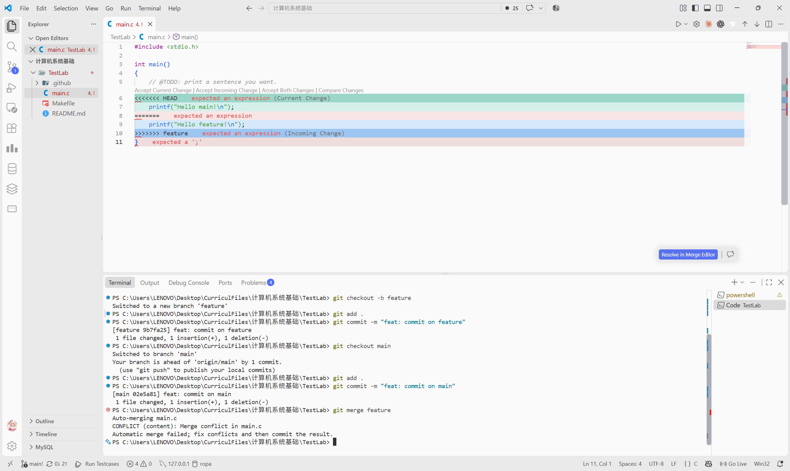
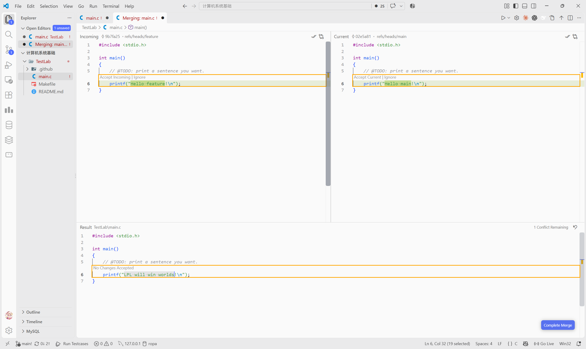

# Lab0：GitLab 实验报告

仓库：[cloud2358/TestLab](https://github.com/cloud2358/TestLab)

## 一、问题回答

**1. 你之前有过多人协同开发的经历吗？如果有，你们是使用什么方式分工协作的？**

没有，此前尚未参与过多人协同开发。

**2. Git 为什么要设计“暂存—提交”两个步骤？**

暂存用于选择本次提交的修改，提交用于将选定内容保存为一个版本。这样可以把不同任务的修改分开，避免混入未完成的代码，也方便提交前检查和之后追溯。

**3. `git branch` 和 `git branch -a` 的区别是什么？**

`git branch` 列出本地分支；`git branch -a` 同时列出本地分支和远程跟踪分支。后者显示的是本地记录的远程状态，不会自动联网更新，需要先执行 `git fetch` 获取最新信息。[参考文档](https://git-scm.com/docs/git-branch)

## 二、阅读总结

**1. Commit Message 规范**

[文章](https://www.ruanyifeng.com/blog/2016/01/commit_message_change_log.html)介绍了用类型、范围和简短描述组织提交说明的方法，例如用 `feat` 表示新增功能、`fix` 表示修复错误、`docs` 表示文档修改。清晰统一的提交说明方便查阅历史、理解修改目的，也有助于生成变更日志。

**2. 语义化版本**

[语义化版本](https://semver.org/lang/zh-CN/)采用“主版本号.次版本号.修订号”。对于稳定的公共 API，不兼容修改增加主版本号，兼容的功能新增增加次版本号，兼容的错误修复增加修订号。版本号由此能帮助使用者判断更新的影响。

**3. 为什么要学习 Git？**

Git 能记录代码修改历史，方便比较版本、定位问题和恢复旧代码；分支与合并支持独立开发和多人协作。即使是个人项目，使用 Git 也能避免手工备份造成的版本混乱。

## 三、实验步骤与截图

1. 使用课程模板创建个人仓库 `TestLab`。
2. 修改 `main.c`，将输出改为 `LPL will win worlds!`，完成首次提交。
3. 创建 `feature` 分支，将输出改为 `Hello feature!` 并提交；切回 `main`，将同一行改为 `Hello main!` 并提交。
4. 在 `main` 合并 `feature`，处理同一行的冲突，最终保留 `Hello main!`，完成合并提交并推送到 GitHub。

**冲突截图：**: 

**解决冲突：** 
